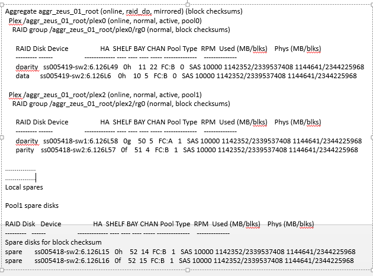

# Jilapi
Jilapi is a Java library to parse unstructured data. The core essence of Jilapi is that given a unstructured input, it produces a structured output. Jilapi was originally written to parse Linux command line output, but it has evolved to handle varying kinds of unstructured data.

##How it works
* Line-wise parser. By default, Jilapi assumes that every output line is a meaningful entity by itself.
  (Jilapi can also be made to work under situation when a single entity spans across multiple lines)
* Every line is further broken down into individual fields.
* Takes the following types of inputs:
     * InputStream
     * A single String with a new line delimiter to mark individual lines.
* The result of the command output parsing is given out either in Java Object or in JSON format.
* It is a standalone jar
* The user of the library is required to provide a [Properties](https://docs.oracle.com/javase/8/docs/api/java/util/Properties.html "java.util.Properties") reference which has command parsing rules. The Properties reference can be instantiated as considered apt by the user, ie sourced from a file/DB etc. Please check the sample [jilapi.properties](src/test/resources/jilapi.properties) file for reference.

## Build
* `git clone git@github.com:BinitaBharati/jilapi.git`
* `cd jilapi`
* `mvn clean;mvn package` - generates the jilapi uber jar.
* The generated jilapi jar can be included in other projects.

## Test
* `mvn test`
 
## Jilapi property
This is the heart of Jilapi. For every command, the user of this library has to pass appropriate [Properties](https://docs.oracle.com/javase/8/docs/api/java/util/Properties.html "java.util.Properties") loaded with command parsing rules. Below is a summary of all the possible properties: <br /> 
* **`<CMND_KEY>.parser.type`**: The command parser types.Currently, 3 parser types are supported:  <br />
      * TabularParser - handles tabular data.This reads data line-wise.
      * ChunkedParser - handles data where-in a entity spans across multiple lines.ie entity data is available in chunks. See [ifconfig -a](#ifconfig--a)
      * NestedParser - handles nested/hierarchical data.This reads data line wise.See [nested output](#nested-output)
* **`<CMND_KEY>.entity.end`**: The delimiter marking end of a complete entity can be demarked.Entity is a the smallest unit of useful data. A command output can have multiple such entities.TabularParser and NestedParser currently supports a new line as entity default delimiter.So, this field need not be specified when parser is tabular/nested.Chunked parser works with blocks of meaningful data.So, entity delimiter need not be a new line.
* **`<CMND_KEY>.result.entity.field.delimiter`**: The delimiter used to delimit across individual fields of a entity.This should be a      unique character, and should not be already present as part of the original output.The default field delimiter when not specified      is SPACE.
* **`<CMND_KEY>.result.sections`**: Useful when the command output has multiple sections.May not be applicable for all commands.
     If a command output has multiple sections, they are demarked using a semi colon character.Please check the 'cmnd3' properties for      a demo of the <CMND_KEY>.result.sections property.
* **`<CMND_KEY>.result.header`**:  The output line preceding the start of the actual data.May not be applicable for all commands.
* **`<CMND_KEY>.result.footer`**: The output line following the end of the actual data.May not be applicable for all commands.
* **`<CMND_KEY>.result.ignore`**: The output line that needs to be ignored.May not be applicable for all commands.
* **`<CMND_KEY>.result.entity.field.positional.map`**: A map representing the position of the fields of an entity in the output.This 
      is mutually exclusive with result.entity.field.prefix.map.s. The map should contain the field positions in ascending order. 
      Eg -> 1:fieldA,4:fieldB,10:fieldC is valid. But, 1:fieldA,10:fieldC,4:fieldB is invalid.
      A single field can spawn across multiple positions (columns) in the output line.See cmnd1's buildTime for a sample of the same.
* **`<CMND_KEY>.result.stop`**: If present, indicates where to stop parsing the given command output.Do not confuse this with footer,       as with footer parsing will keep continuing till EOF, but with stop, parsing completely stops.
* **`<CMND_KEY>.result.entity.field.parser`**: Implementation of com.github.binitabharati.jilapi.entity.parser.EntityParser. Applicable when the command parser type is chunked/nested. 
* **`<CMND_KEY>.nested.hierarchy.id`**: Implementation of `com.github.binitabharati.jilapi.parser.worker.NestedHierarchyIdentifier`. Applicable when command parser type is Nested. This property gives a way to identify each element in a nested hierarchy.
* **`<CMND_KEY>.nested.hierarchy`**: A String representing the nested hierarchy. This entry has the following rules: <br />
       * Each independent hierarchy is demarked with a semi colon.In this context, independent hierarchy means that the hierarchy is wholly unrelated to any existing hierarchy entries.
       * Each element name within the hierarchy has to be prefixed and suffixed with a `%` character. 
       * Every child hierarchy has to be enclosed within `[` and `]`.
       * A parent will specify its children by preceding it with a `->`.
       * A eg entry would be: <br />
        `%A2%->[%A4%->[%A8%->[%A13%,%A14%],%A9%],%A5%];%A3%->[%A6%,%A7%];%A10%->[%A11%->[%A12%]]`


## Quick Start
Lets see few sample commands. <br />
##### uname -a
Executing `uname -a` on a Linux system generates the following output: 


Now, lets understand what attributes of jilapi property file matters in this case.
* **`<CMND_KEY>.parser.type`**: The data can be visialized as tabular data with only a single row and multiple columns.
* **`<CMND_KEY>.entity.end`**: Here a single line contains a complete meaningful entity.Hence, entity delimiter is a new line, which is also the default entity delimiter.Hence, this attribute doesnt apply.
* **`<CMND_KEY>.result.entity.field.delimiter`**:The entity field delimiter is SPACE here, which is also the default.So, this attribute doesnt apply.
* **`<CMND_KEY>.result.sections`**: The output is just a single line.Hence, multiple sections doesnt apply.
* **`<CMND_KEY>.result.header`**: The output is just a single line.Hence, headers doesnt apply.
* **`<CMND_KEY>.result.footer`**: The output is just a single line.Hence, footers doesnt apply.
* **`<CMND_KEY>.result.ignore`**: The output is just a single line.Hence, ignore doesnt apply.
* **`<CMND_KEY>.result.entity.field.positional.map`**: Here each field of the entity is positional.Eg at 1st position we find Kernel version, 2nd position we find Node name etc.The field Build time spans multiple columns, viz column 4 to 11.
* **`<CMND_KEY>.result.stop`**: N/A. The output is just a single line. No specific line where parsing should stop.
* **`<CMND_KEY>.result.entity.field.parser`**: N/A as command parser is tabular.
* **`<CMND_KEY>.nested.hierarchy.id`**: N/A as command parser is tabular.
* **`<CMND_KEY>.nested.hierarchy`**: N/A as command parser is tabular.
<br />
Corresponding property file entry is given below:
```
cmnd1.parser.type=tabular
cmnd1.result.entity.field.positional.map=1:kernelName,2:nodeName,3:kernelVersion,4-11:buildTime,12:processorType,13:hwPlatform,14:processorArch,15:osName
```
##### route -n
Executing `route -n` on a Linux system generates the following output: <br />


Now, lets understand what attributes of jilapi property file matters in this case.
* **`<CMND_KEY>.parser.type`**: The data can be visialized as tabular data.
* **`<CMND_KEY>.entity.end`**: Here each single line contains a complete meaningful entity, which is a route entry.Hence, entity delimiter is a new line, which is also the default entity delimiter.Hence, this attribute doesn't apply.
* **`<CMND_KEY>.result.entity.field.delimiter`**:The entity field delimiter is SPACE here, which is also the default.So, this attribute doesnt apply.
* **`<CMND_KEY>.result.sections`**: There are no sections, as in there is only a single large section.Multiple sections dont apply.
* **`<CMND_KEY>.result.header`**: The lines containing the fields `Destination`,`Gateway`,`Genmask` etc precede the actual route entries.So, the columns `Destination`,`Gateway`,`Genmask` etc is the header.
* **`<CMND_KEY>.result.footer`**: Not applicable.
* **`<CMND_KEY>.result.ignore`**: Not applicable.
* **`<CMND_KEY>.result.entity.field.positional.map`**: Here each field of the entity is positional.Eg at 1st position we find `Destination Network`, 2nd position we find `Gateway` etc.
* **`<CMND_KEY>.result.stop`**: N/A. No specific line where parsing should stop.
* **`<CMND_KEY>.result.entity.field.parser`**: N/A as command parser is tabular.
* **`<CMND_KEY>.nested.hierarchy.id`**: N/A as command parser is tabular.
* **`<CMND_KEY>.nested.hierarchy`**: N/A as command parser is tabular.
<br />
Corresponding property file entry is given below:
```
cmnd2.parser.type=tabular
cmnd2.result.header=Destination,Gateway,Genmask,Flags,Metric,Ref,Use,Iface
cmnd2.result.entity.field.positional.map=1:destinationNw,2:gateway,3:netMask,5:metric,8:port
```
##### route print
Executing `route print` on a Windows system generates the following output: <br />

Now, lets understand what attributes of jilapi property file matters in this case.
* **`<CMND_KEY>.parser.type`**: The data can be visialized as tabular data.
* **`<CMND_KEY>.entity.end`**: Here, a complete meaningful entity, which is a route entry, can be derived from a single line.Hence, entity delimiter is a new line, which is also the default entity delimiter.Hence, this attribute doesn't apply.
* **`<CMND_KEY>.result.entity.field.delimiter`**:The entity field delimiter is SPACE here, which is also the default.So, this attribute doesnt apply.
* **`<CMND_KEY>.result.sections`**: There are multiple sections of route entry here, viz IPv4 route entries and IPv6 route entries.
* **`<CMND_KEY>.result.header`**: Each of the respective sections contain their own headers. Eg: IPv4 route entry has the headers as `Network Destination`,`Netmask`,`Gateway`,`Interface` and `Metric`.
* **`<CMND_KEY>.result.footer`**: Each of the respective sections contain their own footers.Both IPV4 and IPV6 sections have `====` as the footer.
* **`<CMND_KEY>.result.ignore`**: Not applicable.
* **`<CMND_KEY>.result.entity.field.positional.map`**: Here each field of the entity is positional.Eg: In the case of IPv4 section,we find `Destination Network` at 1st position, `Gateway` at 2nd position etc.
* **`<CMND_KEY>.result.stop`**: N/A. No specific line where parsing should stop.
* **`<CMND_KEY>.result.entity.field.parser`**: N/A as command parser is tabular.
* **`<CMND_KEY>.nested.hierarchy.id`**: N/A as command parser is tabular.
* **`<CMND_KEY>.nested.hierarchy`**: N/A as command parser is tabular.
<br />
Corresponding property file entry is given below:
```
cmnd3.parser.type=tabular
cmnd3.result.sections=ipv4Route;ipv6Route
cmnd3.result.header=Network Destination,Netmask,Gateway,Interface,Metric;If,Metric,Network Destination,Gateway
cmnd3.result.footer=\=;\=
cmnd3.result.entity.field.positional.map=1:destinationNw,2:netMask,3:gateway,4:port,5:metric;1:field1,2:metric,3:destination,4:gateway

```
##### /etc/passwd
Executing `cat /etc/passwd` on a Linux system generates the following output: <br />
 <br />
Now, lets understand what attributes of jilapi property file matters in this case.
* **`<CMND_KEY>.parser.type`**: The data can be visialized as tabular data.
* **`<CMND_KEY>.entity.end`**: Here, a complete meaningful entity, which is a route entry, can be derived from a single line.Hence, entity delimiter is a new line, which is also the default entity delimiter.Hence, this attribute doesn't apply.
* **`<CMND_KEY>.result.entity.field.delimiter`**:The entity field delimiter is colon here.So, this attribute's value should be set as `:` in the property file.
* **`<CMND_KEY>.result.sections`**: Not applicable here.
* **`<CMND_KEY>.result.header`**: Not applicable here.
* **`<CMND_KEY>.result.footer`**: Not applicable here.
* **`<CMND_KEY>.result.ignore`**: Not applicable.
* **`<CMND_KEY>.result.entity.field.positional.map`**: Here each field of the entity is positional.Eg: at 1st position we find the user name, 2nd position is the password and so on.
* **`<CMND_KEY>.result.stop`**: N/A. No specific line where parsing should stop, as the required data has to be extracted till the EOF.
* **`<CMND_KEY>.result.entity.field.parser`**: N/A as command parser is tabular.
* **`<CMND_KEY>.nested.hierarchy.id`**: N/A as command parser is tabular.
* **`<CMND_KEY>.nested.hierarchy`**: N/A as command parser is tabular.
<br />
Corresponding property file entry is given below:
```
cmnd4.parser.type=tabular
cmnd4.result.entity.field.positional.map=1:userName,2:passwd,3:userId,4:grpId,5:userFullName,6:homeDirectory,7:shellAccount
cmnd4.result.entity.field.delimiter=:
```

##### ifconfig -a
Executing `ifconfig -a` on a Linux system generates the following output: <br />

Now, lets understand what attributes of jilapi property file matters in this case.
* **`<CMND_KEY>.parser.type`**: The data can be visialized as chunked data.Multiple lines in the output describe a single entity ( interface)
* **`<CMND_KEY>.entity.end`**: Here, a complete meanigful entity, which is a interface detail, can be derived from multiple lines, with demarkation being a empty line between two entities (interfaces).Hence, entity delimiter should be set as `EMPTY_LINE`.
* **`<CMND_KEY>.result.entity.field.delimiter`**: The delimiter between multiple fields of an entity is SPACE.Hence, default holds good.
* **`<CMND_KEY>.result.sections`**: Not applicable here.
* **`<CMND_KEY>.result.header`**: Not applicable here.
* **`<CMND_KEY>.result.footer`**: Not applicable here.
* **`<CMND_KEY>.result.ignore`**: Not applicable here.
* **`<CMND_KEY>.result.entity.field.positional.map`**: Not applicable here.
* **`<CMND_KEY>.result.stop`**: N/A. No specific line where parsing should stop, as the required data has to be extracted till the EOF.
* **`<CMND_KEY>.result.entity.field.parser`**: `com.github.binitabharati.jilapi.entity.parser.impl.IfConfigParser`. This parser decides how best  to extract the data per entity (interface).
* **`<CMND_KEY>.nested.hierarchy.id`**: N/A as command parser is chunked.
* **`<CMND_KEY>.nested.hierarchy`**: N/A as command parser is chunked.
<br />
Corresponding property file entry is given below:
```
cmnd5.parser.type=chunked
cmnd5.entity.end=EMPTY_LINE
cmnd5.result.entity.field.parser=com.github.binitabharati.jilapi.entity.parser.impl.IfConfigParser

```
##### nested output
Consider the below nested output: <br />

<br /> Now, lets understand what attributes of jilapi property file matters in this case.
* **`<CMND_KEY>.parser.type`**: The data can be visialized as nested data.
* **`<CMND_KEY>.entity.end`**: Here, a complete meaningful entity, which is a route entry, can be derived from a single line.Hence, entity delimiter is a new line, which is also the default entity delimiter.Hence, this attribute doesn't apply.
* **`<CMND_KEY>.result.entity.field.delimiter`**: The delimiter between multiple fields of an entity is SPACE.Hence, default holds good.
* **`<CMND_KEY>.result.sections`**: Not applicable here.
* **`<CMND_KEY>.result.header`**: Not applicable here.
* **`<CMND_KEY>.result.footer`**: Not applicable here.
* **`<CMND_KEY>.result.ignore`**: Not applicable here.
* **`<CMND_KEY>.result.entity.field.positional.map`**: In this command output, there is a nested tabular data for element `RAID Disk`.
* **`<CMND_KEY>.result.stop`**: In this command output, there are `RAID Disk` under element `Local spares` too. But, we do not want to consider those.So, parsing must stop when we encounter the String `Local spares`
* **`<CMND_KEY>.result.entity.field.parser`**: There are multiple entities involved here. Aggregate, Plex, RAID Group require their own implementations of `com.github.binitabharati.jilapi.entity.parser.EntityParser`.Whereas, `RAID Disk` represents a tabular data. and can be handled by the OOB `com.github.binitabharati.jilapi.parser.impl.TabularParser`.
* **`<CMND_KEY>.nested.hierarchy.id`**: Defines a way to identify each element in hierarchy. Must implement `com.github.binitabharati.jilapi.parser.worker.NestedHierarchyIdentifier`.
* **`<CMND_KEY>.nested.hierarchy`**: Should define the hierarchy as per the guidelines.
<br />
Corresponding property file entry is given below:
```
cmnd6.parser.type=nested
cmnd6.nested.hierarchy.id=com.github.binitabharati.jilapi.parser.worker.impl.NestedHierarchyIdImpl
cmnd6.nested.hierarchy=%Aggregate%->[%Plex%->[%RAID group%->[%RAID Disk%]]]
cmnd6.result.entity.field.parser=Aggregate=com.github.binitabharati.jilapi.entity.parser.impl.AggregateParser;\
                                  Plex=com.github.binitabharati.jilapi.entity.parser.impl.PlexParser;\
                                  RAID group=com.github.binitabharati.jilapi.entity.parser.impl.RaidGroupParser;\
                                  RAID Disk=com.github.binitabharati.jilapi.parser.impl.TabularParser
cmnd6.result.entity.field.positional.map=RAID Disk=1:raidDisk,2:device,3:ha,4:shelf,5:bay,6:chan,7:pool,8:type,9:rpm,10:usedInMbPerBlocks,11:physicalInMbPerBlocks
cmnd6.result.footer=RAID Disk=EMPTY_LINE
cmnd6.result.ignore=RAID Disk=-
cmnd6.result.stop=Local spares
```


## License

Copyright © 2016 Binita Bharati <br />
Distributed under the Apache license 2.0. 
