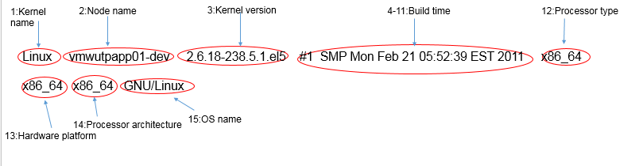
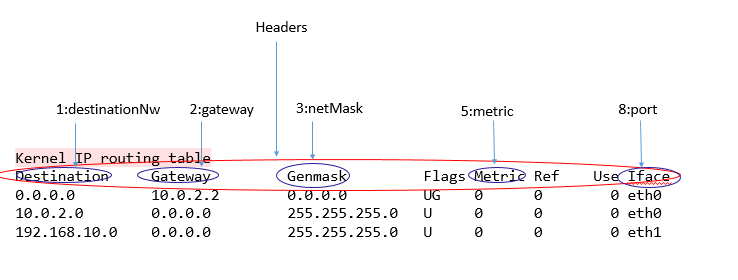
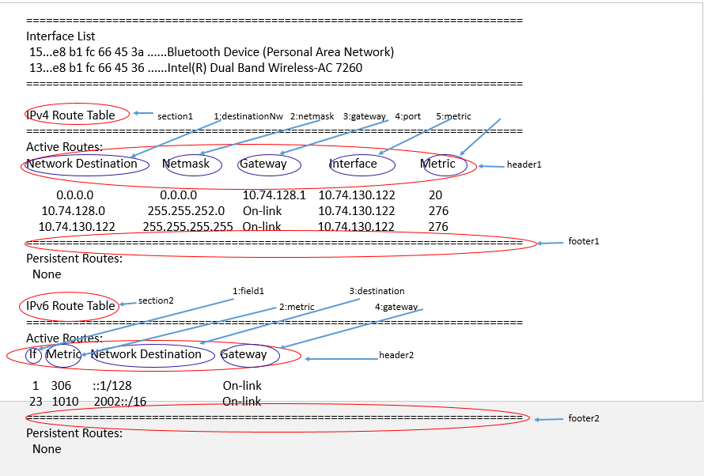
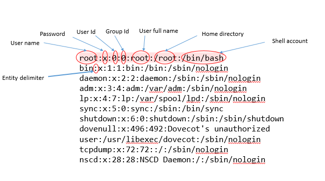
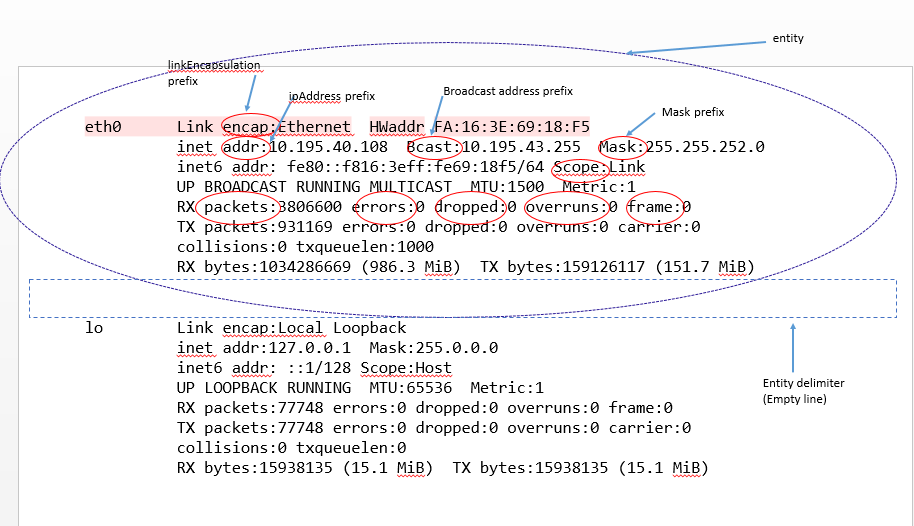

# Jilapi
Jilapi is a Java library to parse OS command line output.

##How it works
* Line-wise parser. By default, Jilapi assumes that every output line is a meaningful entity by itself.
  (Jilapi can also be made to work under situation when a single entity spans across multiple lines)
* Every line is further broken down into individual fields.
* Takes the following types of inputs:
     * InputStream
     * A single String with a new line delimiter to mark individual lines.
* The result of the command output parsing is given out in JSON format.
* It is a standalone jar
* The user of the library is required to provide a [Properties](https://docs.oracle.com/javase/8/docs/api/java/util/Properties.html "java.util.Properties") reference which has command parsing rules. The Properties reference can be instantiated as considered apt by the user, ie sourced from a file/DB etc. Please check the sample [jilapi.properties](src/test/resources/jilapi.properties) file for reference.

## Build
* `git clone git@github.com:BinitaBharati/jilapi.git`
* `cd jilapi`
* `mvn clean;mvn package` - generates the jilapi uber jar.
* The generated jilapi jar can be included in other projects.

## Test
* `mvn test`
 
## Jilapi property
This is the heart of Jilapi. For every command, the user of this library has to pass appropriate [Properties](https://docs.oracle.com/javase/8/docs/api/java/util/Properties.html "java.util.Properties") loaded with command parsing rules. Below is a summary of all the possible properties: <br /> 
* **`<CMND_KEY>.entity.delimiter`**: The delimiter marking a complete entity can be demarked.Entity is a single unit of useful data.
     A command output can have multiple such entities.The default entity delimiter is new line, but it may not be true in all cases.
* **`<CMND_KEY>.result.entity.field.delimiter`**: The delimiter used to delimit across individual fields of a entity.This should be a      unique character, and should not be already present as part of the original output.The default field delimiter when not specified      is SPACE.The delimiter field can take a regex.
     A command output can have multiple such entities.The default entity delimiter is new line.
* **`<CMND_KEY>.result.sections`**: Useful when the command output has multiple sections.May not be applicable for all commands.
     If a command output has multiple sections, they are demarked using a semi colon character.Please check the 'cmnd3' properties for      a demo of the <CMND_KEY>.result.sections property.
* **`<CMND_KEY>.result.header`**:  The output line preceding the start of the actual data.May not be applicable for all commands.
* **`<CMND_KEY>.result.footer`**: The output line following the end of the actual data.May not be applicable for all commands.This field can take a regex.
* **`<CMND_KEY>.result.ignore`**: The output line that needs to be ignored.May not be applicable for all commands.
* **`<CMND_KEY>.result.entity.field.positional.map`**: A map representing the position of the fields of an entity in the output.This 
      is mutually exclusive with result.entity.field.prefix.map.s. The map should contain the field positions in ascending order. 
      Eg -> 1:fieldA,4:fieldB,10:fieldC is valid. But, 1:fieldA,10:fieldC,4:fieldB is invalid.
      A single field can spawn across multiple positions (columns) in the output line.See cmnd1's buildTime for a sample of the same.
      If exact field positioning not available, but instead search texts per field available in the output, then please use 
      result.entity.prefix.map.
* **`<CMND_KEY>.result.entity.field.prefix.map`**: A list enlisting the text content signifying the start of each field of an entity
     in the output.This is mutually exclusive with result.entity.field.positional.map.Please refer to cmnd5 for a sample.

## Quick Start
Lets see few sample commands. <br />
##### uname -a
Executing `uname -a` on a Linux system generates the following output: 


Now, lets understand what attributes of jilapi property file matters in this case.
* **`<CMND_KEY>.entity.delimiter`**: Here a single line contains a complete meanigful entity.Hence, entity delimiter is a new line, which is also the default entity delimiter.Hence, this attribute doesnt apply.
* **`<CMND_KEY>.result.entity.field.delimiter`**:The entity field delimiter is SPACE here, which is also the default.So, this attribute doesnt apply.
* **`<CMND_KEY>.result.sections`**: The output is just a single line.Hence, multiple sections doesnt apply.
* **`<CMND_KEY>.result.header`**: The output is just a single line.Hence, headers doesnt apply.
* **`<CMND_KEY>.result.footer`**: The output is just a single line.Hence, footers doesnt apply.
* **`<CMND_KEY>.result.ignore`**: The output is just a single line.Hence, ignore doesnt apply.
* **`<CMND_KEY>.result.entity.field.positional.map`**: Here each field of the entity is positional.Eg at 1st position we find Kernel version, 2nd position we find Node name etc.The field Build time spans multiple columns, viz column 4 to 11.
* **`<CMND_KEY>.result.entity.field.prefix.map`**: Doesnt apply as `<CMND_KEY>.result.entity.field.positional.map` is already applied.<br />
Corresponding property file entry is given below:
```
cmnd1.result.entity.field.positional.map=1:kernelName,2:nodeName,3:kernelVersion,4-11:buildTime,12:processorType,13:hwPlatform,14:processorArch,15:osName
```
##### route -n
Executing `route -n` on a Linux system generates the following output: <br />


Now, lets understand what attributes of jilapi property file matters in this case.
* **`<CMND_KEY>.entity.delimiter`**: Here each single line contains a complete meanigful entity, which is a route entry.Hence, entity delimiter is a new line, which is also the default entity delimiter.Hence, this attribute doesn't apply.
* **`<CMND_KEY>.result.entity.field.delimiter`**:The entity field delimiter is SPACE here, which is also the default.So, this attribute doesnt apply.
* **`<CMND_KEY>.result.sections`**: There are no sections, as in there is only a single large section.Multiple sections dont apply.
* **`<CMND_KEY>.result.header`**: The lines containing the fields `Destination`,`Gateway`,`Genmask` etc precede the actual route entries.So, the columns `Destination`,`Gateway`,`Genmask` etc is the header.
* **`<CMND_KEY>.result.footer`**: Not applicable.
* **`<CMND_KEY>.result.ignore`**: Not applicable.
* **`<CMND_KEY>.result.entity.field.positional.map`**: Here each field of the entity is positional.Eg at 1st position we find `Destination Network`, 2nd position we find `Gateway` etc.
* **`<CMND_KEY>.result.entity.field.prefix.map`**: Doesnt apply as `<CMND_KEY>.result.entity.field.positional.map` is already applied.<br />
Corresponding property file entry is given below:
```
cmnd2.result.header=Destination,Gateway,Genmask,Flags,Metric,Ref,Use,Iface
cmnd2.result.entity.field.positional.map=1:destinationNw,2:gateway,3:netMask,5:metric,8:port
```
##### route print
Executing `route print` on a Windows system generates the following output: <br />

Now, lets understand what attributes of jilapi property file matters in this case.
* **`<CMND_KEY>.entity.delimiter`**: Here, a complete meanigful entity, which is a route entry, can be derived from a single line.Hence, entity delimiter is a new line, which is also the default entity delimiter.Hence, this attribute doesn't apply.
* **`<CMND_KEY>.result.entity.field.delimiter`**:The entity field delimiter is SPACE here, which is also the default.So, this attribute doesnt apply.
* **`<CMND_KEY>.result.sections`**: There are multiple sections of route entry here, viz IPv4 route entries and IPv6 route entries.
* **`<CMND_KEY>.result.header`**: Each of the respective sections contain their own headers. Eg: IPv4 route entry has the headers as `Network Destination`,`Netmask`,`Gateway`,`Interface` and `Metric`.
* **`<CMND_KEY>.result.footer`**: Each of the respective sections contain their own footers.Both IPV4 and IPV6 sections have `====` as the footer.
* **`<CMND_KEY>.result.ignore`**: Not applicable.
* **`<CMND_KEY>.result.entity.field.positional.map`**: Here each field of the entity is positional.Eg: In the case of IPv4 section,we find `Destination Network` at 1st posistion, `Gateway` at 2nd position etc.
* **`<CMND_KEY>.result.entity.field.prefix.map`**: Doesnt apply as `<CMND_KEY>.result.entity.field.positional.map` is already applied.<br />
Corresponding property file entry is given below:
```
cmnd3.result.sections=ipv4Route;ipv6Route
cmnd3.result.header=Network Destination,Netmask,Gateway,Interface,Metric;If,Metric,Network Destination,Gateway
cmnd3.result.footer=\=+;\=+
cmnd3.result.entity.field.positional.map=1:destinationNw,2:netMask,3:gateway,4:port,5:metric;1:field1,2:metric,3:destination,4:gateway
```
##### /etc/passwd
Executing `cat /etc/passwd` on a Linux system generates the following output: <br />
 <br />
Now, lets understand what attributes of jilapi property file matters in this case.

* **`<CMND_KEY>.entity.delimiter`**: Here, a complete meanigful entity, which is a route entry, can be derived from a single line.Hence, entity delimiter is a new line, which is also the default entity delimiter.Hence, this attribute doesn't apply.
* **`<CMND_KEY>.result.entity.field.delimiter`**:The entity field delimiter is colon here.So, this attribute's value should be set as `:` in the property file.
* **`<CMND_KEY>.result.sections`**: Not applicable here.
* **`<CMND_KEY>.result.header`**: Not applicable here.
* **`<CMND_KEY>.result.footer`**: Not applicable here.
* **`<CMND_KEY>.result.ignore`**: Not applicable.
* **`<CMND_KEY>.result.entity.field.positional.map`**: Here each field of the entity is positional.Eg: at 1st position we find the user name, 2nd position is the password and so on.
* **`<CMND_KEY>.result.entity.field.prefix.map`**: Doesnt apply as `<CMND_KEY>.result.entity.field.positional.map` is already applied.<br />
Corresponding property file entry is given below:
```
cmnd4.result.entity.field.positional.map=1:userName,2:passwd,3:userId,4:grpId,5:userFullName,6:homeDirectory,7:shellAccount
cmnd4.result.entity.field.delimiter=:
```

##### ifconfig -a
Executing `ifconfig -a` on a Linux system generates the following output: <br />

Now, lets understand what attributes of jilapi property file matters in this case.
* **`<CMND_KEY>.entity.delimiter`**: Here, a complete meanigful entity, which is a interface detail, can be derived from multiple lines, with demarkation being a empty line between two entities (interfaces).Hence, entity delimiter should be set as `EMPTY_LINE`.
* **`<CMND_KEY>.result.entity.field.delimiter`**: The delimiter between multiple fields of an entity is SPACE.Hence, default holds good.
* **`<CMND_KEY>.result.sections`**: Not applicable here.
* **`<CMND_KEY>.result.header`**: Not applicable here.
* **`<CMND_KEY>.result.footer`**: Not applicable here.
* **`<CMND_KEY>.result.ignore`**: Not applicable here.
* **`<CMND_KEY>.result.entity.field.positional.map`**: Here each field of the entity can be found by a prefix.Hence, positional map doesnt apply.Prefix map should be applied.
* **`<CMND_KEY>.result.entity.field.prefix.map`**: `encap:` is the prefix to extract link encapsulation value, `addr:` is the prefix to extract IP address, and so on. <br />
Corresponding property file entry is given below:
```
cmnd5.entity.delimiter=EMPTY_LINE
cmnd5.result.entity.field.prefix.map=encap::linkEncapsulation,addr::inetAddr,Bcast::bcastAddress,Mask::mask,Scope::scope,packets::rxPackets,errors::errors,dropped::dropped,overruns::overruns,frame::frame

```


## License

Copyright © 2016 Binita Bharati <br />
Distributed under the Eclipse Public license. 
